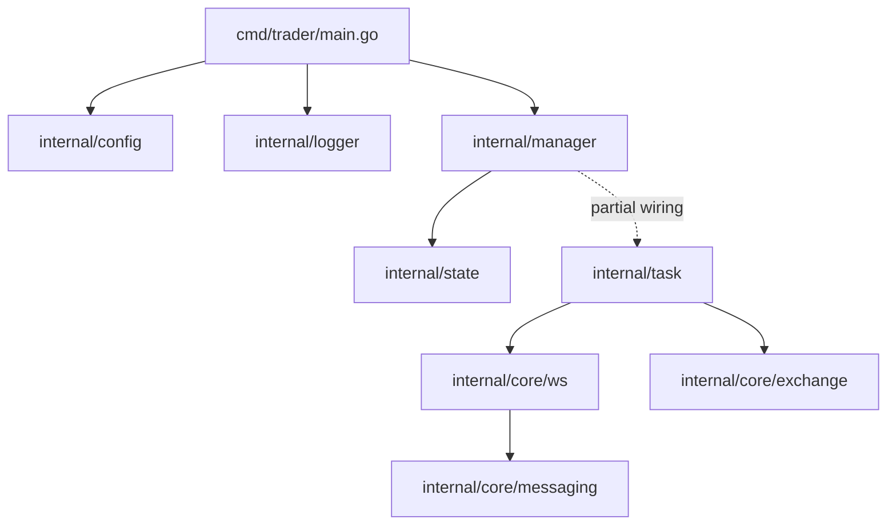
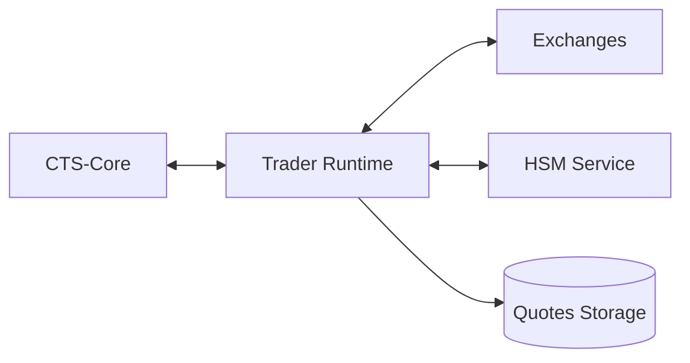

# Trader Architecture

> Версия документа: 2.1.0
> Обновлено: 2026-03-26
> Статус: актуализирован под текущее состояние кода

## Оглавление

0. Статус реализации
1. Роль сервиса в CT-System
2. Принятые решения
3. Текущая архитектура (as-is)
4. Целевая архитектура (to-be)
5. Компоненты
6. Протоколы и коммуникация
7. Безопасность и observability
8. Отказоустойчивость
9. Развертывание
10. Границы документа

---

## 0. Статус реализации

Срез по коду на 2026-03-26:

- Реализовано:
	- bootstrap `config -> logger -> manager -> graceful shutdown`
	- outbound-first модель процесса
	- базовые типы домена (`exchange`, `messaging`)
	- логический WS слой (`subscribe/unsubscribe`, корреляция `event_id <-> request_id`)
	- task diff/apply слой (`task/types`, `task/subscription_manager`)
- Частично:
	- orchestration каркас в `manager` без полного runtime wiring
	- WS transport как full exchange connector
- Не реализовано полностью:
	- production exchange drivers и end-to-end market data pipeline
	- execution runtime торговых стратегий
	- полнофункциональный monitor pipeline записи рыночных данных

Документ ниже разделяет текущую архитектуру (`as-is`) и целевую (`to-be`).

---

## 1. Роль сервиса в CT-System

`trader` - исполнительный сервис торгового контура в составе CT-System.

Ключевая роль:

- получать задачи от `cts-core`
- поддерживать биржевые подключения
- обрабатывать рыночные события
- исполнять торговые решения в рамках локальной стратегии
- отправлять телеметрию и результаты исполнения обратно в `cts-core`

Ограничение текущего этапа: в кодовой базе готова только часть этого контура.

---

## 2. Принятые решения

1. `trader` работает как outbound клиент.
2. Логирование унифицировано с остальными сервисами CT-System: JSON + file streams.
3. Текущий WS модуль в `internal/core/ws` используется как orchestration/logging слой, а не как финальный transport runtime.
4. Задачи представлены через внутренние модели и diff/apply механику без привязки документации к конкретной СУБД.
5. Приоритет документации: фактический код > roadmap описания.

---

## 3. Текущая архитектура (as-is)

### 3.1 Runtime последовательность

1. `cmd/trader/main.go` загружает конфигурацию
2. Инициализируется логирование
3. Создается `manager`
4. Стартует `manager` (lifecycle)
5. Процесс ожидает `SIGINT/SIGTERM`
6. Выполняется graceful shutdown

### 3.2 Логическая схема текущих модулей

Примечание: пунктир отражает частичную интеграцию (каркас уже есть, полный runtime контур еще в работе).

---

## 4. Целевая архитектура (to-be)

Целевое поведение:

- `cts-core` задает workload и принимает heartbeat/metrics/result events
- `trader` держит market connectivity и execution loop
- `hsm-service` используется для криптографических операций по доступу к секретам
- рыночные данные и/или агрегаты отправляются в quotes storage

---

## 5. Компоненты

### 5.1 Реализованные

- `internal/config/config.go`
	- YAML конфиг + env overrides
- `internal/logger/logger.go`
	- `error`, `out_request`, `ws_in`, `ws_out`, `audit`
- `internal/manager/manager.go`
	- lifecycle (`Start`, `Stop`, `Status`)
- `internal/state/state.go`
	- сохранение runtime-state
- `internal/core/exchange/types.go`
	- доменные типы и ключи
- `internal/core/messaging/message.go`
	- структуры унифицированных сообщений
- `internal/core/ws/ws.go`
	- subscribe/unsubscribe API, correlation map, TTL cleanup
- `internal/task/types.go`
	- общая модель входных задач
- `internal/task/subscription_manager.go`
	- diff/apply подписок

### 5.2 В работе / не завершено

- полноценный WS transport к биржам
- execution engine стратегий
- end-to-end monitor ingestion pipeline
- полная orchestration связка модулей через manager

---

## 6. Протоколы и коммуникация

Текущие и целевые каналы:

1. `trader <-> cts-core`
	- текущий этап: закладывается WS lifecycle contract
	- цель: `register`, `heartbeat`, `task flow`, `result flow`
2. `trader <-> exchanges`
	- цель: WS market data + REST order execution
3. `trader <-> hsm-service`
	- цель: криптооперации для защищенного доступа к секретам

---

## 7. Безопасность и observability

1. Безопасность
	- минимизация поверхности атаки через контролируемые интеграционные каналы
	- чувствительные данные не должны логироваться в открытом виде
2. Observability
	- структурированные JSON логи
	- отдельные лог-потоки для network/audit/operational событий
	- корреляция `request_id` и `event_id` в WS-слое

---

## 8. Отказоустойчивость

Текущее состояние:

- graceful shutdown c timeout
- базовые защитные механизмы lifecycle

Целевые дополнения:

- автопереподключение к биржам
- устойчивый reconnect/backoff в transport слое
- предсказуемое восстановление подписок после reconnect

---

## 9. Развертывание

1. Dev
	- запуск в составе root `docker-compose` окружения CT-System
2. Production (целевая модель)
	- изолированные `trader` инстансы
	- масштабирование по числу стратегий/биржевых связок

---

## 10. Границы документа

Этот файл фиксирует архитектурный контур `trader` и не заменяет:

- `README.md` (операционный обзор)
- `DEVELOPMENT_PLAN.md` (план и этапы работ)

При расхождении с реализацией в `cmd/` и `internal/` приоритет у кода.
