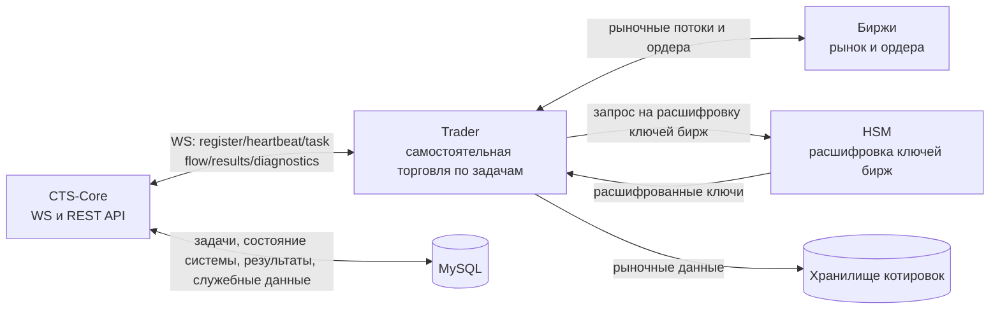
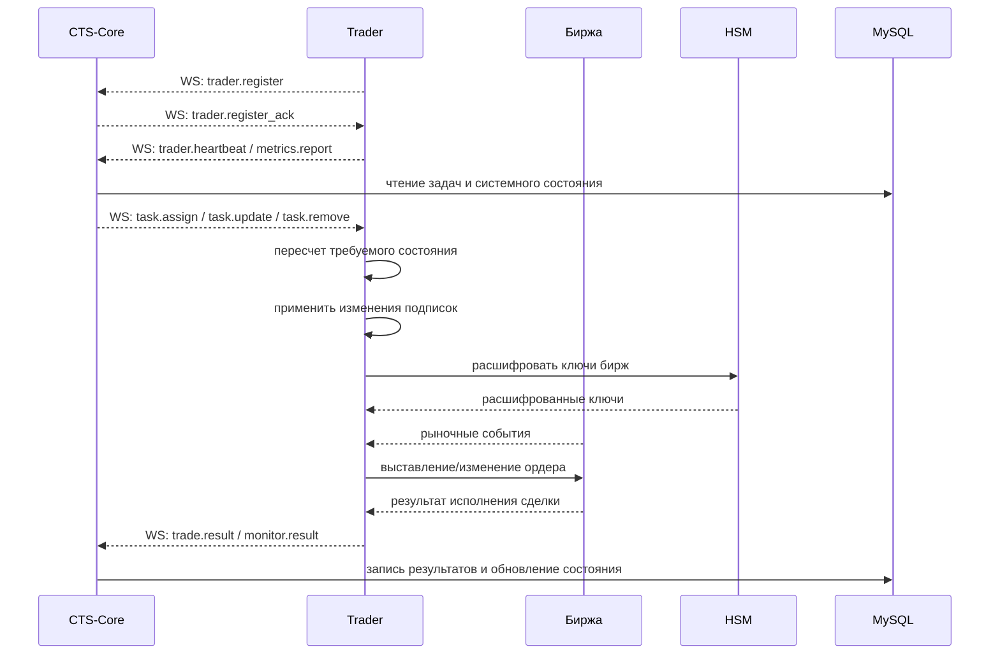
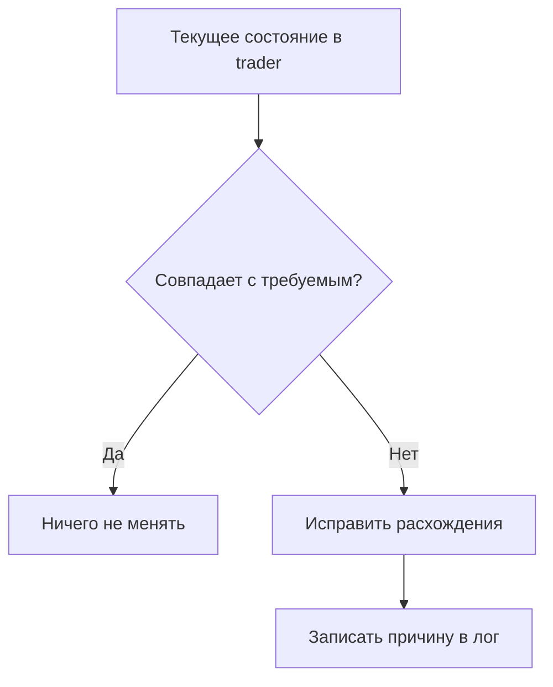

# План Развития Trader

> Версия: 4.0
> Дата: 2026-03-28
> Без оценок по времени, только этапы и критерии готовности

## 1. Для чего нужен этот план

Цель сервиса `trader`:

- получать задачи от `cts-core` в реальном времени;
- поддерживать подключения к биржам;
- исполнять торговые действия;
- отправлять подтверждения и результаты сделок в `cts-core` по WS;
- отправлять диагностику сервиса и диагностику подключений к биржам.

Этот документ описывает, что должно быть сделано по шагам и как понять, что шаг завершен.

## 2. Что есть сейчас

Уже реализовано:

- запуск и остановка процесса (`config -> logger -> manager -> shutdown`);
- модели задач и механизм расчета изменений подписок;
- слой журналирования для WS-взаимодействия;
- единый формат логов (`error`, `out_request`, `ws_in`, `ws_out`, `audit`).

Пока отсутствует:

- полноценный обмен командами с `cts-core` как основной путь управления;
- рабочий контур реальных подключений к биржам;
- рабочий контур исполнения торговых задач;
- рабочий контур сбора и записи рыночных данных.

## 3. Целевая картина

## 4. Принцип работы после рефакторинга

### 4.1 Основной путь управления

Команды приходят по WS и обрабатываются сразу, без ожидания периодического опроса.

### 4.2 Страховочный путь

Периодическая сверка состояния остается, но только как защита от рассинхрона.

## 5. Обязательные правила

1. Совместимость с `cts-core`:
   - `trader.register -> trader.register_ack`
   - `trader.heartbeat`
   - корректная обработка ошибок протокола.
2. Разделение ответственности:
   - `cts-core` выбирает исполнителя;
   - решение `buy/sell` принимает `trader`.
3. Наблюдаемость:
   - JSON-логи;
   - сквозная связь событий по `request_id` и `event_id`.
4. Тестовый контур:
   - локальные тесты сервиса;
   - минимальная интеграция;
   - полный системный прогон.

## 6. Этапы работ

### Этап 1. Сборка внутреннего цикла

Собрать устойчивый внутренний цикл применения задач и корректной остановки.

Готово, когда:

- цикл стабильно работает и виден в логах;
- остановка процесса завершается без зависаний и утечек горутин.

### Этап 2. Реальное управление от CTS-Core

Сделать WS-команды основным путем изменения состояния `trader`.

Готово, когда:

- задачи применяются сразу после входящей команды;
- периодическая сверка используется только как страховка.

### Этап 3. Реальные подключения к бирже

Подключить минимум одну биржу с восстановлением после обрыва.

Готово, когда:

- рыночный поток приходит стабильно;
- после обрыва подписки восстанавливаются автоматически.

### Этап 4. Контур рыночных данных

Сделать буферизацию и запись рыночных данных в хранилище.

Готово, когда:

- запись идет стабильно;
- есть контроль пропусков, задержек и нагрузки.

### Этап 5. Контур исполнения сделок

Сделать минимальный рабочий путь `задача -> исполнение -> результат`.

Готово, когда:

- выполнение задачи доходит до результата;
- повторная доставка команды не приводит к двойному исполнению.

### Этап 6. Эксплуатационная устойчивость

Закрыть риски для работы в составе полной системы.

Готово, когда:

- полный системный прогон проходит стабильно;
- документация соответствует фактической реализации.

## 7. Критерии качества

- `go test ./...` проходит;
- сборка бинарника проходит;
- совместимость с WS-контрактом `cts-core` подтверждена;
- логи содержат достаточный контекст для расследования ошибок;
- остановка процесса корректна в штатном и аварийном сценариях.

## 8. Definition of Done ближайшего релиза

Релиз готов, если одновременно выполнено:

- команды от `cts-core` меняют состояние `trader` в реальном времени;
- страховочная сверка устраняет рассинхрон без ручного вмешательства;
- есть минимум один рабочий путь подключения к бирже;
- есть рабочий контур `задача -> исполнение -> результат`;
- тесты и логирование соответствуют системному контракту CT-System.
